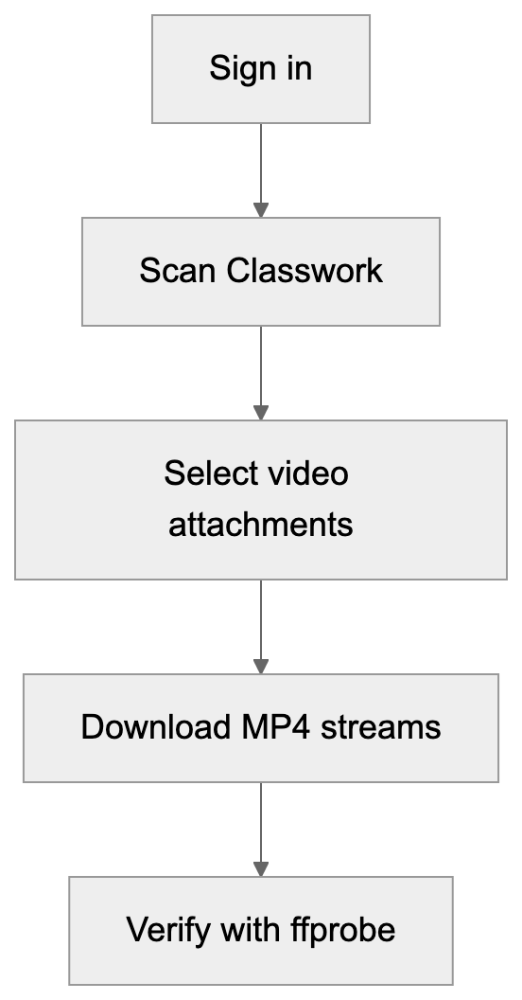

# classroom-video-dl

Download video attachments from a Google Classroom course that your account can view. The tool discovers videos in Classwork, downloads the available MP4 streams, and checks the files with `ffprobe`.

## Requirements

- Node.js 20+, Python 3.10+, `ffprobe`, and `jq`
- A Google account with access to the course
- Enough local disk space for the recordings

## Quick start

```bash
git clone https://github.com/herman181920/classroom-video-dl.git
cd classroom-video-dl
npm install
npx playwright install chromium
node scripts/auth_profile.cjs
./scripts/run_video_pipeline.sh "https://classroom.google.com/c/<course-id>"
```

The sign-in command opens Chromium for you to sign in. Recordings are saved in `recordings/`. Re-running the pipeline skips completed downloads.

## How it works



The downloader uses a persistent Playwright browser profile and an undocumented Google Drive playback API, which may change. See [how it works](docs/how-it-works.md) for technical details and [troubleshooting](docs/troubleshooting.md) for common failures.

## Configuration

| Variable | Purpose | Default |
| --- | --- | --- |
| `COURSE_DL_PROFILE` | Directory containing the Playwright sign-in session | OS cache directory |
| `USER_EMAIL` | Select an account by email substring | First signed-in account |
| `N` | Parallel downloads | `3` |
| `SKIP_SCRAPE` | Reuse `fresh_scrape.json` | Unset |
| `PY` | Python interpreter for the pipeline | `python3` |

The browser profile contains session cookies. Keep it private. The tool uses the playback stream available to your signed-in account; check your course's rules before saving or sharing recordings.

## License

[Apache-2.0](LICENSE)
